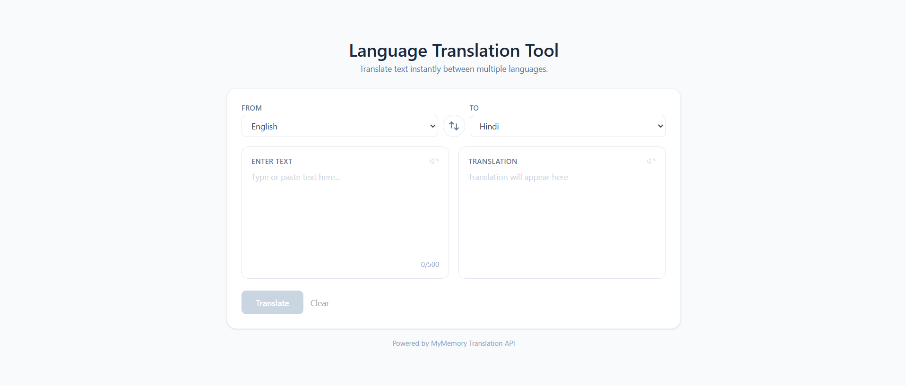
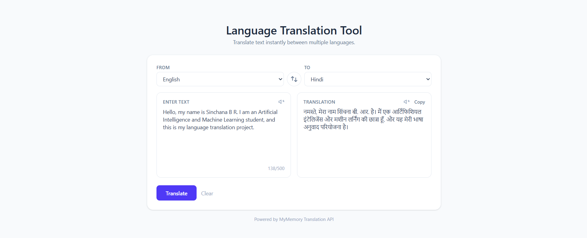

# 🌐 Language Translation Tool

A full-stack web application that translates text between 35+ languages in real time — an independent project built to practice full-stack development and API integration.

## 📖 Overview

This tool allows users to enter text, select a source and target language, and receive an instant translation powered by a live translation API. It was built with a focus on clean UI/UX, proper error handling, and production-quality code structure — suitable for a professional portfolio.

## ✨ Features

- 🔤 Translate text between 35+ languages
- 🔄 Swap source and target languages instantly
- 📋 Copy translated text with one click
- 🔊 Text-to-speech playback (browser-native, no extra setup)
- ⏳ Loading indicator during translation
- ⚠️ Clear error messages for empty input, API failures, and invalid language pairs
- 📱 Fully responsive design (desktop and mobile)
- 🔡 Live character counter with input limit

## 🛠️ Technologies Used

**Frontend:** React (Vite), Tailwind CSS
**Backend:** Python, Flask, Flask-CORS
**Translation:** [MyMemory Translation API](https://mymemory.translated.net/) (no API key required)
**Other:** Web Speech API (browser-native text-to-speech)

## 🔄 System Workflow

1. User enters text and selects source/target languages in the React UI.
2. Frontend sends a `POST` request to the Flask backend (`/api/translate`).
3. Flask backend validates the input and forwards the request to the MyMemory Translation API.
4. MyMemory returns the translated text.
5. Flask sends the result back to the frontend as JSON.
6. React displays the translated text, with options to copy or listen to it.

## 📁 Project Structure
language-translator/
├── backend/
│ ├── app.py # Flask app & /api/translate route
│ ├── requirements.txt
│ ├── .env.example
│ └── .gitignore
├── frontend/
│ ├── src/
│ │ ├── components/ # LanguageSelector, TextPanel, SpeakButton, etc.
│ │ ├── constants/ # languages.js — supported language list
│ │ ├── App.jsx
│ │ └── main.jsx
│ ├── vite.config.js
│ └── package.json
└── README.md

## ⚙️ Installation

### Prerequisites
- Node.js (v18+)
- Python (v3.9+)

### Clone the repository
```bash
git clone https://github.com/sinchanabr430/language-translation-tool.git
cd language-translation-tool
```

## 🔑 Environment Variables

This project uses the MyMemory Translation API, which **requires no API key**. The `.env.example` file in `backend/` is included as a placeholder in case you switch to a paid provider (e.g. Google Cloud Translation) in the future.

## ▶️ Running the Backend

```bash
cd backend
python -m venv venv
venv\Scripts\activate        # Windows
# source venv/bin/activate   # macOS/Linux
pip install -r requirements.txt
python app.py
```
Backend runs on `http://localhost:5000`.

## ▶️ Running the Frontend

```bash
cd frontend
npm install
npm run dev
```
Frontend runs on `http://localhost:5173`.

## 📸 Screenshots

### Main Interface


### Translation in Action


## 🚀 Future Enhancements

- Translation history with local storage
- Dark mode
- Auto-detect source language (via a provider that supports it)
- User accounts to save favorite translations

## 📄 License

This project was built independently for educational purposes and portfolio development.